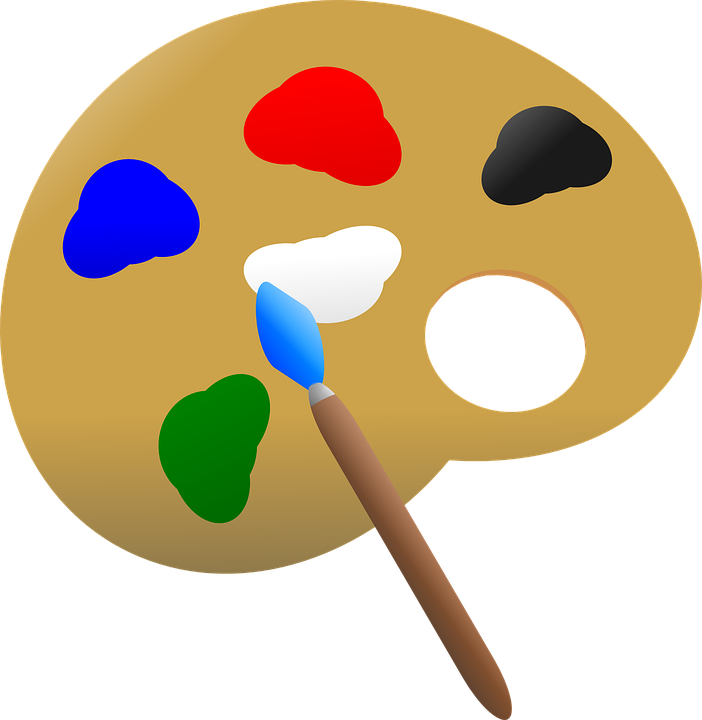

# Paint A Picture

Welcome to the Paint a Picture page! Paint a Picture is a program I made in processing.js, a port library of the processing language for JavaScript, another programming language. 

The application consists of many features, which can be found [on my Khan Academy version of this in the features section at the top of the code](https://www.khanacademy.org/computer-programming/paint-a-picture-v219/4631918938554368). You can view the changelog in the [releases section](https://github.com/KnowledgeableKangaroo/paint-a-picture-backup/releases) of the respository. Below will be the simulation in a canvas of the paint a picture. 

<canvas id = "mycanvas"></canvas>

<button onclick = "goToHomePage()" type = "button" style = "width: 30%;"> Home </button>

## Attributions ##

### Favicon ###

 

